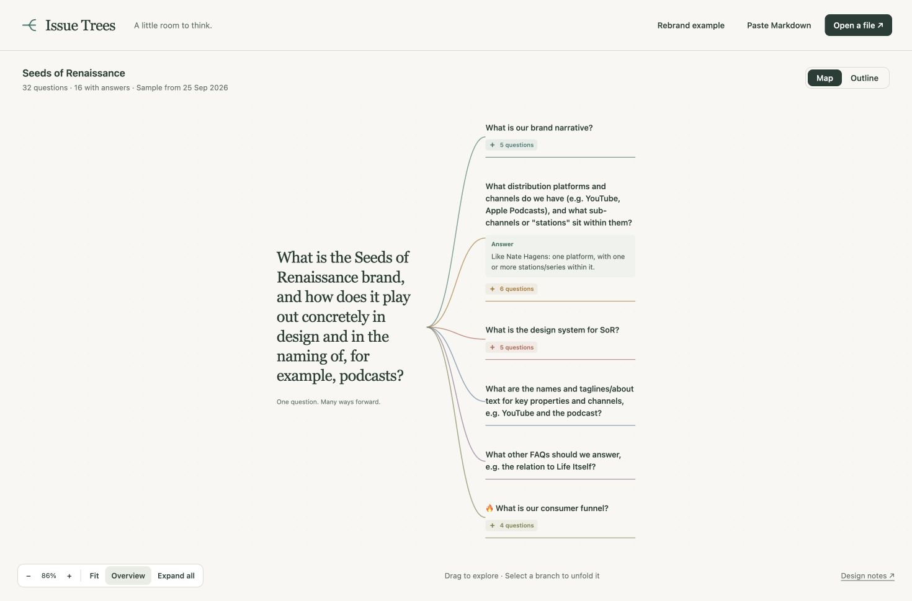

A first local viewer turns Markdown issue trees into expandable maps, with answers beneath their questions and an outline for smaller screens. Try it with the Seeds of Renaissance rebrand example using the [local setup instructions](../tools/viewer/README.md); it is not publicly deployed yet.

