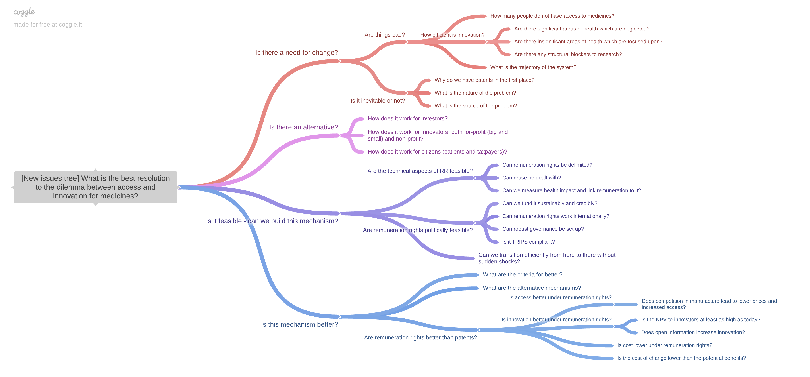
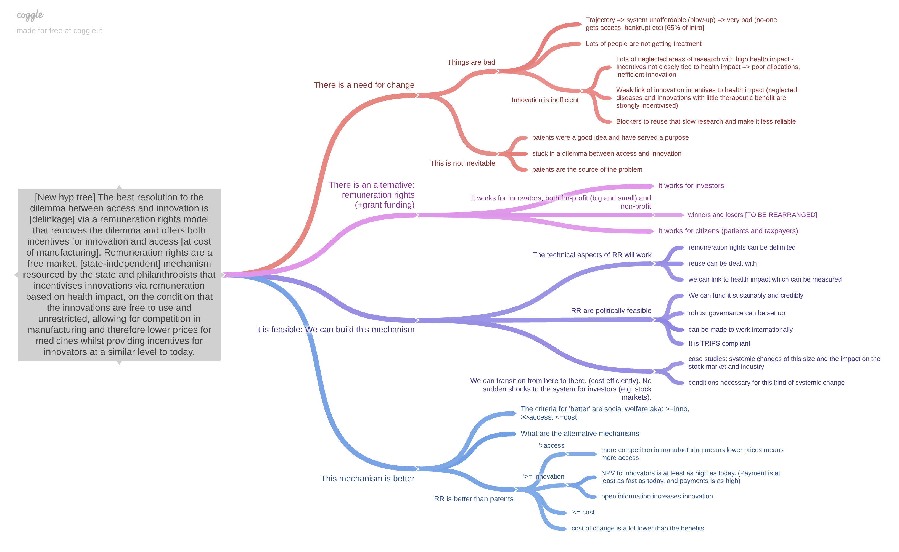

- Do We Need Wiser Education? - https://lifeitself.org/blog/2019/10/13/wise-education-gathering-2019
- iMED project - https://imedproject.org/research/ (SCQ) and white paper for full trees https://imedproject.org/data/imed-white-paper.pdf

## IMED

The IMED project explores how to resolve the dilemma between access to medicines and incentives for innovation.

### Issue tree

### Hypothesis tree

